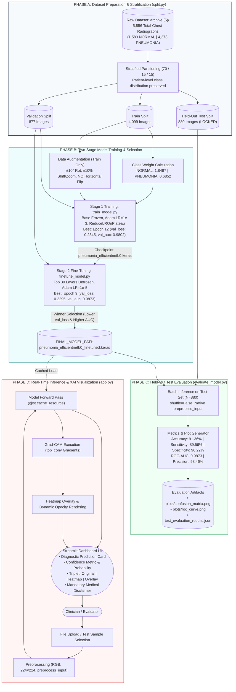

# AI-Based Pneumonia Detection System with Explainable AI (Grad-CAM)

> **⚠️ CLINICAL DISCLAIMER:**  
> This software is an educational/research prototype and clinical decision-support demonstration tool. It is **NOT** a certified medical device and is **NOT** a substitute for clinical radiological assessment, laboratory testing, or formal diagnosis by a licensed medical practitioner.

---

## 1. Project Overview

This repository contains an end-to-end deep learning system for automated binary detection of pneumonia from chest radiographs (X-rays), integrated with **Explainable Artificial Intelligence (XAI)** using Gradient-weighted Class Activation Mapping (Grad-CAM).

### What Has Actually Been Built (Scope & Capabilities)
- **Target Disease:** Binary classification of Frontal Chest X-Rays into **`NORMAL`** (healthy) vs. **`PNEUMONIA`** (bacterial or viral).
- **Core Architecture:** Transfer learning with **EfficientNetB0** (pre-trained on ImageNet), fine-tuned on clinical chest X-rays.
- **Explainability:** Grad-CAM saliency heatmaps generated directly from the final convolutional feature map (`top_conv`), highlighting spatial activation regions contributing to the classification.
- **Evaluation:** Strict held-out testing on **880 unseen radiographs** (achieving **91.36% Accuracy**, **89.56% Sensitivity**, and **0.9873 ROC-AUC**).
- **Interface:** Interactive web dashboard developed in **Streamlit** allowing single-image drag-and-drop inference, opacity-controlled Grad-CAM overlays, and benchmark test case inspection.

---

## 2. System Architecture Diagram

The system employs a dual-path pipeline: a **Predictive Inference Path** that outputs diagnostic class probabilities, and a parallel **Explainability Path** that computes gradient-weighted activation maps from the deepest convolutional feature map.

```mermaid
graph TD
    subgraph Input_Tier ["1. Input & Preprocessing Tier"]
        RawImg["Frontal Chest X-Ray<br/>(JPEG / PNG / DICOM-derived)"]
        Preproc["Preprocessing Pipeline (utils.py)<br/>• Convert to RGB<br/>• Bilinear Resize to 224 × 224<br/>• preprocess_input: Native [0, 255] Scaling"]
        RawImg --> Preproc
    end

    subgraph Backbone_Tier ["2. Deep Convolutional Feature Extraction (EfficientNetB0)"]
        StemConv["Stem Conv3x3 & BN & Swish<br/>(Input: 224 × 224 × 3)"]
        MBConvBlocks["Stages 1-6: MBConv Blocks<br/>(Depthwise Separable + Squeeze-and-Excitation)"]
        Stage7["Stage 7: MBConv Block (Layers 207-236)<br/>*Unfrozen during Stage 2 Fine-Tuning*"]
        TopConv["Target Conv Layer: 'top_conv'<br/>(Feature Maps: 7 × 7 × 1280)"]
        TopBN["Top Batch Normalization & Swish<br/>('top_bn' & 'top_activation')"]
        
        Preproc --> StemConv
        StemConv --> MBConvBlocks
        MBConvBlocks --> Stage7
        Stage7 --> TopConv
        TopConv --> TopBN
    end

    subgraph Head_Tier ["3. Classification Head (Stage 1 Trained)"]
        GAP["GlobalAveragePooling2D<br/>(Collapses 7 × 7 spatial grid → 1280-D vector)"]
        Drop["Dropout Layer (p = 0.20)<br/>*Prevents co-adaptation of weights*"]
        DenseSig["Dense Layer (1 unit, Sigmoid Activation)<br/>Output: Raw Probability P(Pneumonia)"]
        Threshold["Decision Gate (Fixed Threshold τ = 0.50)<br/>P ≥ 0.50 → PNEUMONIA<br/>P < 0.50 → NORMAL"]
        
        TopBN --> GAP
        GAP --> Drop
        Drop --> DenseSig
        DenseSig --> Threshold
    end

    subgraph XAI_Tier ["4. Explainable AI Engine (gradcam.py)"]
        GradTape["tf.GradientTape Context<br/>Computes Gradients: ∂y_c / ∂A^k"]
        PoolGrads["Global Spatial Average Pooling<br/>Importance Weights: α_k^c = (1/Z) ∑∑ (∂y_c / ∂A^k_ij)"]
        WeightedSum["Linear Combination & ReLU Rectification<br/>L_GradCAM = ReLU( ∑ α_k^c A^k )"]
        NormResize["Normalization [0, 1] & Bicubic Upsample<br/>Resized to 224 × 224 Activation Heatmap"]
        CVOverlay["OpenCV Rendering Engine<br/>• Apply COLORMAP_JET<br/>• Alpha Blend with Original Radiograph"]
        
        TopConv -.->|"Feature Maps A^k"| GradTape
        DenseSig -.->|"Target Class Score y_c"| GradTape
        GradTape --> PoolGrads
        PoolGrads --> WeightedSum
        TopConv -.-> WeightedSum
        WeightedSum --> NormResize
        NormResize --> CVOverlay
        RawImg -.->|"Original Alignment"| CVOverlay
    end

    subgraph UI_Tier ["5. Presentation & Decision Support (app.py)"]
        StreamlitApp["Streamlit Web Application<br/>• @st.cache_resource Model Caching<br/>• Side-by-Side Triplet Visualizer<br/>• Opacity Transparency Slider<br/>• Prominent Medical Disclaimers"]
        Threshold --> StreamlitApp
        CVOverlay --> StreamlitApp
    end

    style Input_Tier fill:#EBF8FF,stroke:#3182CE,stroke-width:2px
    style Backbone_Tier fill:#F0FFF4,stroke:#38A169,stroke-width:2px
    style Head_Tier fill:#FEFCBF,stroke:#D69E2E,stroke-width:2px
    style XAI_Tier fill:#FAF5FF,stroke:#805AD5,stroke-width:2px
    style UI_Tier fill:#FFF5F5,stroke:#E53E3E,stroke-width:2px
```



---

## 3. Data Flow Diagram (DFD)

The data flow spans two lifecycle phases: **Offline Training & Verification (Data-at-Rest)** and **Online Clinical Decision Support (Data-in-Motion)**.



---

## 4. Technology Stack Analysis: Working, Need, and Clinical Benefits

Every library and architectural component was deliberately chosen to satisfy stringent medical imaging requirements, computational constraints, and clinical interpretability needs.

### Technology Evaluation & Rationale Matrix

| Technology | Architectural Role | Working Principle | Why Needed? (The Problem It Solves) | Concrete Benefit to This Project |
|---|---|---|---|---|
| **TensorFlow & Keras 3** | Deep Learning Core & Automatic Differentiation | Builds symbolic computational graphs; provides `tf.GradientTape` for exact backward-pass gradient tracking. | Standard inference frameworks (like ONNX or TFLite) cannot compute gradients w.r.t. intermediate internal convolutional layers during runtime. | Enables seamless multi-output execution, exact mathematical Grad-CAM backpropagation, oneDNN CPU acceleration, and robust `.keras` serialization. |
| **EfficientNetB0** | Convolutional Feature Extractor (Backbone) | Compound scaling balances depth, width, and resolution using a compound coefficient $\phi$; utilizes Mobile Inverted Bottleneck (MBConv) blocks with Squeeze-and-Excitation (SE). | Heavy networks (VGG16 has 138M params, ResNet50 has 25.6M params) severely overfit on medical datasets ($N=4,099$) and require massive GPU memory. | Contains only **4.05 million parameters**, preventing over-parameterization memorization while achieving superior feature abstraction and rapid CPU inference (~40ms). |
| **Grad-CAM (XAI)** | Decision Explainability & Saliency Mapping | Computes $\frac{\partial y_c}{\partial A^k}$, spatially pools gradients into weights $\alpha_k^c$, sums feature maps, and applies ReLU rectification to isolate positive contributions. | Deep learning models are clinical "black boxes". Clinicians cannot trust predictions without knowing *where* the model is looking, risking undetected "shortcut learning" (e.g. reading hospital text markers). | Provides visual accountability, reveals algorithmic bias (e.g. identifying the "SUPINE" marker effect), and validates true alveolar consolidation detection. |
| **OpenCV (cv2)** | Image Processing & Thermal Visualization | High-performance C++ image processing routines; matrix resizing, color space transforms, and weighted linear alpha blending. | Raw activation arrays are floating-point $7 \times 7$ matrices. They must be upsampled, pseudocolored, and blended with radiographs with sub-pixel precision. | Generates standardized clinical thermal heatmaps (`COLORMAP_JET`), resizes arrays smoothly with bicubic interpolation, and enables real-time overlay blending via `cv2.addWeighted`. |
| **Streamlit** | Clinical Interface & Decision-Support App | Reactive UI server that maps Python functions to interactive web components; manages session state and resource caching via `@st.cache_resource`. | Command-line scripts are inaccessible to physicians and clinical evaluators. Building custom React/Node frontends introduces unnecessary complexity and latency. | Delivers a clean, zero-friction medical dashboard with persistent model caching (prevents reloading 27MB weights per inference) and real-time opacity sliders. |
| **Scikit-Learn** | Analytical Metrics & Imbalance Mitigation | Computes optimal inverse class weights ($\text{balanced}$ mode), generates confusion matrices, and computes multi-threshold ROC-AUC curves. | Medical datasets exhibit clinical skew (1:2.7 imbalance). Standard training without weighting causes the loss function to collapse into majority-class bias. | Computes exact mathematical weights ($\text{NORMAL}=1.8497$, $\text{PNEUMONIA}=0.6852$), preventing majority-class dominance, and calculates held-out test metrics. |
| **Pillow (PIL) & NumPy** | Image Ingestion & Vectorized Tensor Ops | Manages raw image file decoders, converts arbitrary bit depths/channels to standard 3-channel RGB, and handles array broadcasting. | Medical radiographs arrive in arbitrary formats (grayscale 8-bit, 16-bit, RGBA with alpha channels). The network strictly expects $(1, 224, 224, 3)$ float tensors. | Prevents silent channel mismatch crashes, standardizes all inputs to RGB, and ensures exact compatibility with EfficientNet's native `preprocess_input`. |

---

## 5. Experimental Results Summary

Evaluated on the **880-image held-out test set** at the pre-fixed $0.50$ decision threshold:

| Metric | Score | Clinical Interpretation |
|---|---|---|
| **Accuracy** | **91.36%** (804 / 880) | Overall correct diagnostic proportion |
| **Precision (PPV)** | **98.46%** (575 / 584) | High positive predictive value; very few false alarms (9 false positives) |
| **Recall / Sensitivity** | **89.56%** (575 / 642) | Detects ~9 out of every 10 pneumonia cases (67 false negatives) |
| **Specificity (TNR)** | **96.22%** (229 / 238) | Accurately identifies 96.22% of healthy normal lungs |
| **F1-Score** | **0.9380** | Balanced harmonic precision-recall score |
| **ROC-AUC** | **0.9873** | Threshold-independent discriminative capacity |

For complete tabular logs across Stage 1 and Stage 2 training, refer to [`EXPERIMENTS.md`](./EXPERIMENTS.md).

---

## 6. Repository Structure

```
AI-based-Medical-Diagnosis/
├── app.py                         # Streamlit web application with XAI viewer
├── evaluate_model.py              # Phase 4 held-out test evaluation script
├── finetune_model.py              # Stage 2 fine-tuning script (unfreezes top 30 layers)
├── train_model.py                 # Stage 1 feature extraction script (frozen base)
├── gradcam.py                     # Phase 5 Grad-CAM generation pipeline
├── utils.py                       # Shared model loading, path detection & preprocessing
├── requirements.txt               # Pinned runtime dependencies
├── .gitignore                     # Git ignore rules for datasets, models, caches
├── EXPERIMENTS.md                 # Complete quantitative experiment records
├── VIVA_PREP.md                   # Viva exam defense guide with project numbers
├── plots/                         # Generated evaluation and training curves
│   ├── confusion_matrix.png
│   ├── roc_curve.png
│   ├── accuracy_finetune.png
│   └── loss_finetune.png
├── gradcam_outputs/               # Generated test triplet visualizations
│   ├── 01_correct_normal_1_triplet.png
│   ├── 03_correct_pneumonia_1_triplet.png
│   └── 05_misclassified_FN_triplet.png
└── processed_dataset/             # 70/15/15 partitioned dataset (train/val/test)
```

---

## 7. Getting Started & Execution

### Installation
Clone this repository and install dependencies in Python 3.11:

```bash
pip install -r requirements.txt
```

### Reproducing Evaluation (Phase 4)
To evaluate the final fine-tuned model against the untouched test set:

```bash
python evaluate_model.py
```

### Generating Grad-CAM Triplet Plots (Phase 5)
To extract layer `top_conv` activations and save triplet visualizations:

```bash
python gradcam.py
```

### Running the Web Application (Phase 6)
To launch the interactive diagnostic dashboard:

```bash
streamlit run app.py
```

---

## 8. Future Work / Scalability (Broader Academic Vision)

The broader academic synopsis for this project envisions an enterprise multi-modal clinical platform. The present codebase establishes the validated, production-grade core classifier for pneumonia. Future iterations can scale this foundation across the following axes:

1. **Multi-Disease Expansion:** Extending the backbone with multi-head outputs for pulmonary conditions (COVID-19, Tuberculosis, Atelectasis) and distinct modalities (Brain MRI for gliomas, Dermoscopy for melanoma).
2. **User Authentication & Role-Based Access (RBAC):** Implementing JWT- or OAuth2-backed portals separating Radiologists, Attending Physicians, and Medical Students.
3. **Persistent Diagnostic Audit Logs:** Integrating an encrypted relational database (SQLite/PostgreSQL) with DICOM image metadata extraction and longitudinal patient tracking.
4. **Clinical Threshold Calibration:** Implementing cost-sensitive operating points ($\tau \approx 0.35$) to drive sensitivity above 95% for emergency department triage workflows.
